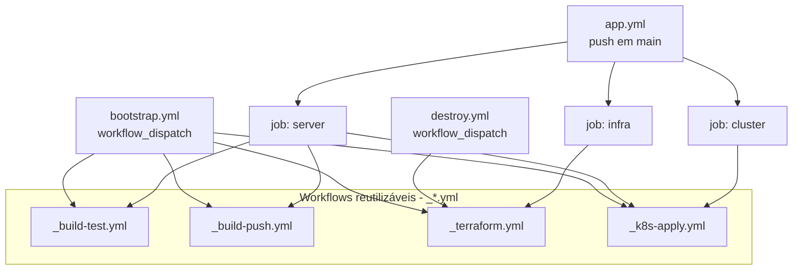

# Plano de Pipelines (GitHub Actions)

Este documento descreve como implementar os workflows de CI/CD do projeto, reaproveitando o máximo de código possível através de **reusable workflows** (`workflow_call`) e **actions oficiais**, evitando scripts customizados (bash/node/etc).

## Visão geral



Toda a lógica de "como fazer" (build, push, terraform, apply) fica **apenas** nos 4 workflows reutilizáveis. Os três workflows "de entrada" (`bootstrap.yml`, `destroy.yml`, `app.yml`) só decidem **quando** e **em qual ordem** chamá-los, passando `inputs`.

## Arquivos a criar

```
.github/workflows/
  _build-test.yml     (workflow_call) - restore/build/test das 5 APIs
  _build-push.yml      (workflow_call) - docker build + push das 5 imagens no ECR
  _terraform.yml       (workflow_call) - init/plan/apply ou destroy de foundation e addons
  _k8s-apply.yml        (workflow_call) - kubectl apply -k k8s (ou delete, se necessário)
  bootstrap.yml         (workflow_dispatch) - chama tudo, em ordem, manualmente
  destroy.yml           (workflow_dispatch) - destroi addons + foundation
  app.yml               (push em main, com path filters) - jobs condicionais
```

> Convenção: workflows com `_` no início são "internos" (chamados via `uses: ./.github/workflows/_x.yml`), não aparecem no botão "Run workflow".

---

## 1. `_build-test.yml` (reusable)

**Objetivo:** restaurar, buildar e testar a solution `.slnx`, cobrindo as 5 APIs de uma vez (o `.slnx` já referencia todos os projetos e testes).

- Trigger: `workflow_call` (sem inputs necessários — a solution inteira é buildada/testada de uma vez).
- Steps (actions nativas):
  1. `actions/checkout@v7`
  2. `actions/setup-dotnet@v6` (informar `dotnet-version: 10.0.x`, já que os Dockerfiles usam SDK 10.0)
  3. `dotnet restore "server/TechChallenge.Oficina.API.slnx"`
  4. `dotnet build "server/TechChallenge.Oficina.API.slnx" -c Release --no-restore`
  5. `dotnet test "server/TechChallenge.Oficina.API.slnx" -c Release --no-build`

Como existe uma única solution com todos os projetos e todos os testes (`Tests/*`), um único `dotnet build`/`dotnet test` já cobre as 5 APIs. Isso evita repetir 5 jobs.

---

## 2. `_build-push.yml` (reusable)

**Objetivo:** buildar as 5 imagens de container e publicar no ECR privado, reaproveitando o `docker-compose.yml` que já existe na raiz do repositório — os mesmos comandos usados localmente (`docker compose build` / `docker compose push`), sem duplicar a lista de Dockerfiles/contextos em outro lugar.

- Trigger: `workflow_call`
  - `inputs.image-tag` (string, obrigatório) — tag usada em todas as imagens, vinda de `vars.IMAGE_TAG` (ex.: `latest`).
- Steps (actions nativas + CLI do Docker Compose, já embutido nos runners `ubuntu-latest`):
  1. `actions/checkout@v7`
  2. `aws-actions/configure-aws-credentials@v6` (usa secrets de AWS)
  3. `aws-actions/amazon-ecr-login@v2` → autentica o Docker no ECR
  4. `docker compose build api approval-api createos-api getos-api status-api`
  5. `docker compose push api approval-api createos-api getos-api status-api`

  Nos passos 4 e 5, as variáveis já usadas pelo `docker-compose.yml` são definidas via `env:` do job, vindas de secrets/vars do repositório, sem precisar de arquivo `.env`:
  ```yaml
  env:
    REGISTRY_PREFIX: ${{ vars.ECR_REGISTRY }}/
    IMAGE_TAG: ${{ inputs.image-tag }}
  ```

Resultado: as 5 imagens (`api`, `approval-api`, `createos-api`, `getos-api`, `status-api`) são buildadas e publicadas com a mesma tag (`image-tag`), usando exatamente a mesma definição de build que os desenvolvedores já usam localmente com `docker compose up --build`.

---

## 3. `_terraform.yml` (reusable)

**Objetivo:** compartilhar a execução de Terraform tanto para `foundation` quanto para `addons`, e tanto para `apply` quanto para `destroy`.

- Trigger: `workflow_call`
  - `inputs.working-directory` (string, obrigatório) — `infra/foundation` ou `infra/addons`.
  - `inputs.command` (string, obrigatório) — `apply` ou `destroy`.
- Steps:
  1. `actions/checkout@v7`
  2. `aws-actions/configure-aws-credentials@v6`
  3. `hashicorp/setup-terraform@v4`
  4. `terraform init` (`working-directory: ${{ inputs.working-directory }}`)
  5. `terraform validate`
  6. `terraform ${{ inputs.command }} -auto-approve`

**Sem `terraform.tfvars` no CI:** em vez de gerar o arquivo (que exigiria um script para escrever o arquivo), usar variáveis de ambiente nativas do Terraform (`TF_VAR_<nome>`), definidas a partir de secrets/vars do repositório diretamente no `env:` do job/step. Terraform lê `TF_VAR_*` automaticamente, sem nenhum script. Ex.: `TF_VAR_rds_password: ${{ secrets.RDS_PASSWORD }}`.

- `bootstrap.yml` chama este workflow 2x (foundation e addons) com `command: apply`, em sequência (`needs`).
- `destroy.yml` chama este workflow 2x, na ordem inversa (addons antes de foundation), com `command: destroy`.
- `app.yml` (job `infra`) chama 2x com `command: apply`, quando `infra/**` mudar.

---

## 4. `_k8s-apply.yml` (reusable)

**Objetivo:** aplicar os manifestos Kubernetes (`k8s/`) usando `kubectl apply -k`.

- Trigger: `workflow_call`
- Steps (actions nativas):
  1. `actions/checkout@v7`
  2. `aws-actions/configure-aws-credentials@v6`
  3. `azure/setup-kubectl@v5` (garante uma versão fixa do `kubectl`)
  4. `aws eks update-kubeconfig --name ${{ vars.EKS_CLUSTER_NAME }} --region ${{ vars.AWS_REGION }}` — comando nativo da AWS CLI (já vem instalada nos runners `ubuntu-latest`), não é script custom.
  5. `kubectl apply -k k8s`
  6. `kubectl rollout restart deployment -n oficina -l app.kubernetes.io/part-of=techchallenge-oficina` — este comando força a recriação dos pods das 5 APIs de uma vez (via label selector), puxando a imagem atual do ECR.

> Os 5 `k8s/features/*/deployment.yml` já apontam para a tag fixa `:latest` e usam `imagePullPolicy: Always`, para que o `rollout restart` sempre busque a imagem atual no ECR em vez de reaproveitar o cache local do node.

**Secret do `.env` do kustomize:**
 o `k8s/kustomization.yaml` usa `secretGenerator` lendo `k8s/.env` (ignorado pelo Git).
 No CI, esse arquivo precisa existir antes do `kubectl apply -k`.
 Como não há uma action nativa para "gerar arquivo de secret", este é o único ponto do pipeline com script em poweshell, 
 apenas `Set-Content` para um arquivo `.env` das duas variáveis de secret:

```powershell
"DatabaseSettings__ConnectionString=Host=${{ vars.RDS_ENDPOINT }};Port=5432;Database=${{ vars.RDS_DATABASE }};Username=${{ vars.RDS_USERNAME }};Password=${{ secrets.RDS_PASSWORD }}" | Set-Content k8s/.env
"ResendSettings__ApiKey=${{ secrets.RESEND_API_KEY }}" | Add-Content k8s/.env
```
Assim, temos:

- `bootstrap.yml` chama este workflow depois do terraform e do build-push, passando `restart-pods: true`.
- `app.yml` (job `server`) chama passando `restart-pods: true` (imagens novas no ECR).
- `app.yml` (job `cluster`) chama **sem** `restart-pods` (reaplica manifestos como estão, só quando algo em `k8s/` mudou, sem trocar imagem).

---

## 5. `bootstrap.yml`

- Trigger: `workflow_dispatch` (manual, sem inputs obrigatórios).
- Jobs, em sequência via `needs`:
  1. `build-test` → `uses: ./.github/workflows/_build-test.yml`
  2. `build-push` (needs: build-test) → `uses: ./.github/workflows/_build-push.yml` com `image-tag: ${{ vars.IMAGE_TAG }}`
  3. `terraform-foundation` (needs: build-push) → `uses: ./.github/workflows/_terraform.yml` (`working-directory: infra/foundation`, `command: apply`)
  4. `terraform-addons` (needs: terraform-foundation) → `uses: ./.github/workflows/_terraform.yml` (`working-directory: infra/addons`, `command: apply`)
  5. `k8s-apply` (needs: terraform-addons) → `uses: ./.github/workflows/_k8s-apply.yml` com `restart-pods: true`

Isso cobre, na ordem, os 5 passos pedidos (build/test → build imagens → push ECR → infra via Terraform → apply k8s).

---

## 6. `destroy.yml`

- Trigger: `workflow_dispatch` (manual — destrutivo, não deve rodar sozinho por push).
- Jobs, em sequência:
  1. `terraform-destroy-addons` → `uses: ./.github/workflows/_terraform.yml` (`working-directory: infra/addons`, `command: destroy`)
  2. `terraform-destroy-foundation` (needs: terraform-destroy-addons) → `uses: ./.github/workflows/_terraform.yml` (`working-directory: infra/foundation`, `command: destroy`)

Recomenda-se proteger este workflow com um **Environment** do GitHub (`production` ou `destroy`) exigindo aprovação manual antes de rodar, já que é destrutivo.

---

## 7. `app.yml`

- Trigger: `push` para `main`.
- Job inicial `changes` usa `dorny/paths-filter@v4` (action nativa, sem script) para detectar o que mudou:

```yaml
jobs:
  changes:
    runs-on: ubuntu-latest
    outputs:
      infra: ${{ steps.filter.outputs.infra }}
      server: ${{ steps.filter.outputs.server }}
      k8s: ${{ steps.filter.outputs.k8s }}
    steps:
      - uses: actions/checkout@v7
      - uses: dorny/paths-filter@v4
        id: filter
        with:
          filters: |
            infra:
              - 'infra/**'
            server:
              - 'server/**'
            k8s:
              - 'k8s/**'
```

- Jobs condicionais (usam `if: needs.changes.outputs.<x> == 'true'`):

| Job         | Condição                       | Chama                                                                 |
|-------------|---------------------------------|------------------------------------------------------------------------|
| `infra`     | `infra/**` mudou               | `_terraform.yml` (foundation, `apply`) → depois `_terraform.yml` (addons, `apply`) |
| `server`    | `server/**` mudou               | `_build-test.yml` → `_build-push.yml` → `_k8s-apply.yml` (com `restart-pods: true`) |
| `cluster`   | `k8s/**` mudou                  | `_k8s-apply.yml` (sem `restart-pods`)                                     |

Os três jobs (`infra`, `server`, `cluster`) dependem apenas de `changes` e são **independentes entre si** (podem rodar em paralelo), pois cada um mexe em uma camada diferente (infraestrutura AWS, imagens/deploy da aplicação, manifestos k8s).

---

## Secrets e Variables do GitHub necessários

Configurar em **Settings → Secrets and variables → Actions** do repositório.

### Secrets (sensíveis)

| Nome                     | Uso                                                                 |
|--------------------------|----------------------------------------------------------------------|
| `AWS_ACCESS_KEY_ID`      | Credencial do usuário IAM `terraform` (build-push, terraform, k8s-apply) |
| `AWS_SECRET_ACCESS_KEY`  | Idem                                                                  |
| `RDS_PASSWORD`           | Senha do RDS — usada como `TF_VAR_rds_password` no Terraform e no `.env` do k8s |
| `RESEND_API_KEY`         | Chave da API do Resend (usada no `.env` do k8s)                      |

### Variables (não sensíveis)

| Nome               | Valor de exemplo                                              |
|---------------------|----------------------------------------------------------------|
| `AWS_REGION`        | `us-east-1`                                                    |
| `ECR_REGISTRY`      | `903936907231.dkr.ecr.us-east-1.amazonaws.com`                 |
| `EKS_CLUSTER_NAME`  | `techchallenge-oficina-eks`                                    |
| `RDS_ENDPOINT`      | endpoint do RDS (disponível como output do Terraform; pode ser atualizado manualmente após o primeiro apply) |
| `RDS_DATABASE`      | `oficina`                                                       |
| `RDS_USERNAME`      | `sa` (não sensível, valor fixo do projeto)                      |
| `IMAGE_TAG`         | `latest` — tag fixa, reaproveitada em toda build/push (o ECR é mutável: cada push sobrescreve a mesma tag; o deploy força um `rollout restart` para atualizar os pods) |

---

## Observações finais

- Nenhum step usa scripts custom em Node/Bash além do trecho mínimo de 2 linhas para materializar `k8s/.env` (inevitável, pois o `secretGenerator` do Kustomize exige um arquivo físico).
- `terraform.tfvars` deixa de ser necessário no CI: substituído por variáveis `TF_VAR_*`, mantendo o arquivo local (`.gitignore`) apenas para uso manual do desenvolvedor, conforme já documentado em [infra/README.md](../../infra/README.md).
- Concurrency: recomenda-se adicionar `concurrency: { group: infra-terraform, cancel-in-progress: false }` nos jobs que chamam `_terraform.yml`, para impedir dois applies/destroys simultâneos no mesmo state.
